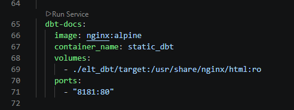
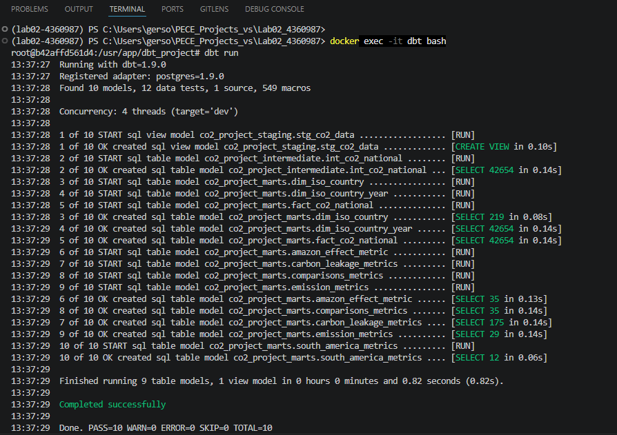
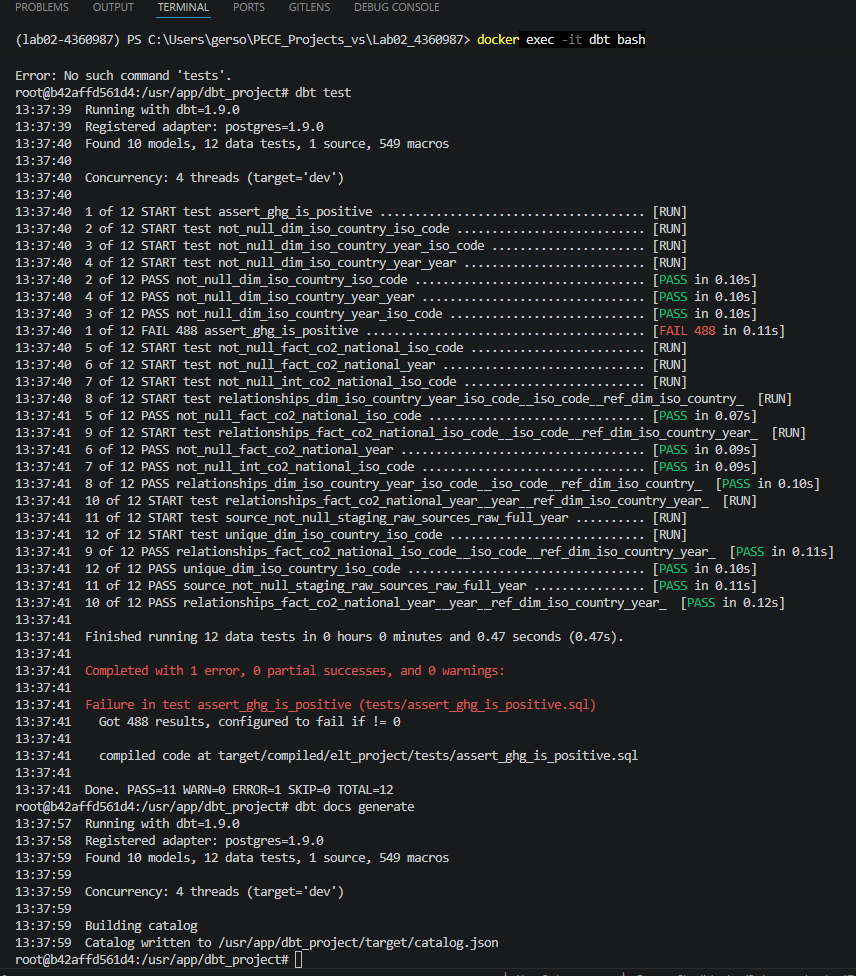
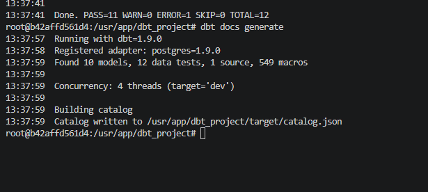
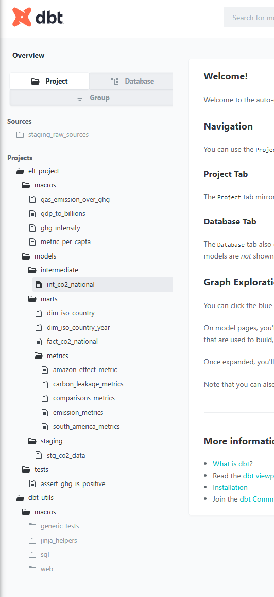
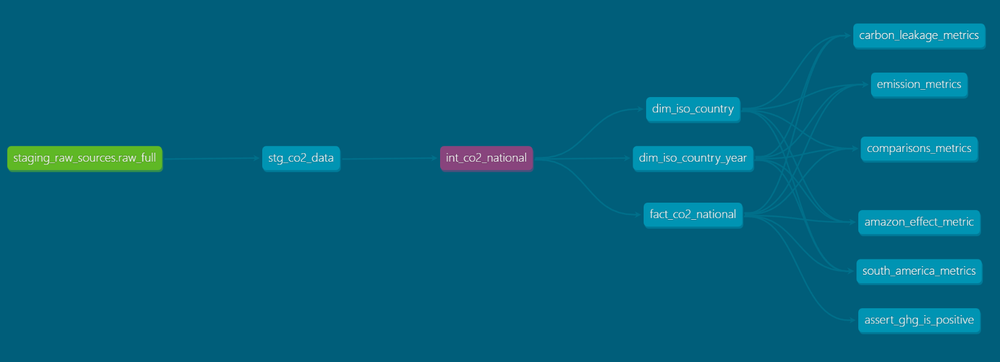
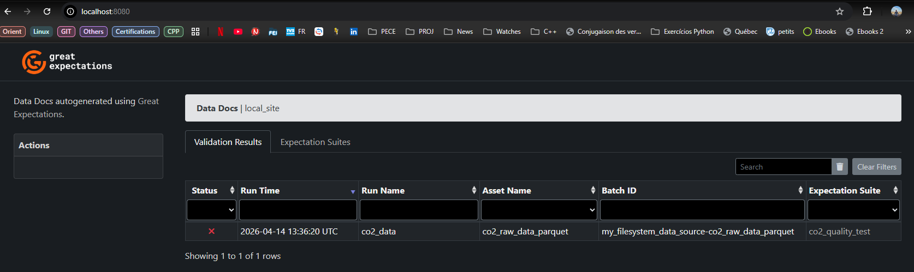
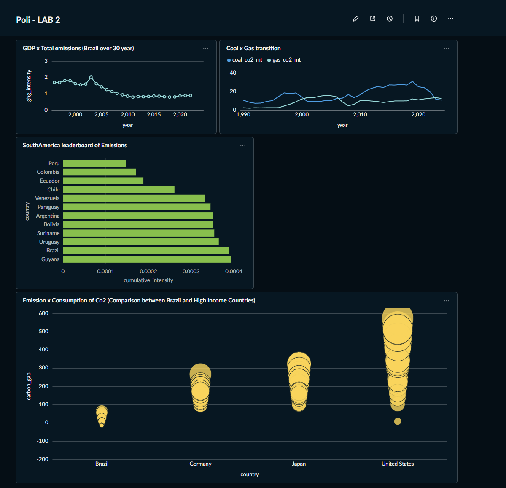

# Lab 02 - Engenharia de Dados e Big Data (Poli-USP)
## Pipeline de Dados CO2 & PIB: Arquitetura de Medalhão com dbt

Este repositório contém a solução completa para o Laboratório 02. O projeto implementa um pipeline ELT (Extract, Load, Transform) utilizando **dbt (data build tool)** para a camada de transformação, **Great Expectations** para qualidade de dados e **Metabase** para visualização.

---

## Como Reproduzir o Ambiente

Para reproduzir o ambiente de desenvolvimento, siga os passos abaixo utilizando o Docker.

### 1. Clonar o Repositório
```bash
git clone <url-do-seu-repositorio>
cd <nome-da-pasta-do-projeto>
```

### 2. Subir os Containers
A arquitetura é orquestrada via Docker Compose, subindo simultaneamente o Postgres, Metabase, e servidores Nginx para documentação.
```bash
docker-compose up -d --build
```
> **Imagem 1: Container dbt**


### 3. Executar o pipeline dbt
Dentro do container dbt, execute os comandos para processar as camadas Bronze, Silver e Gold:
```bash
docker exec -it dbt bash  # Entrar no Container dbt
dbt deps                  # Instalar dependências (dbt-utils)
dbt run                   # Executar transformações e criar as tabelas Marts
dbt test                  # Validar a integridade dos dados
dbt docs generate         # Gerar a documentação técnica
```
> **Imagem 2: Pipeline dbt - dbt run**


> **Imagem 3: Pipeline dbt - dbt test**


> **Imagem 4: Pipeline dbt - dbt docs**



## Arquitetura do Projeto
O pipeline foi estruturado seguindo as melhores práticas de Engenharia de Dados:

- Camada Bronze: Dados brutos carregados diretamente no Postgres.

- Camada Silver: Limpeza de tipos, tratamento de valores nulos e padronização de ISO Codes.

- Camada Gold (Marts): Agregações de negócio, incluindo métricas de Emissão Per Capita e Intensidade de Carbono, utilizando Macros reutilizáveis.

## Documentação e Linhagem (dbt Docs)
A documentação gerada automaticamente pelo dbt permite auditar o dicionário de dados e entender a origem de cada métrica.

1. Tela de Documentação
- Disponível em: http://localhost:8181

Aqui estão listadas todas as colunas, descrições e testes aplicados aos modelos de dados.

> **Imagem 5: dbt docs - Localhost:8181**


2. Linhagem de Dados (Lineage Graph)
O gráfico de linhagem visualiza o fluxo dos dados desde as fontes (sources) até às tabelas finais de análise (marts).

> **Imagem 6: Lineage**


## Qualidade de Dados (Great Expectations)
Antes das transformações, os dados passam por uma camada de validação de qualidade (GX) para garantir que o esquema e os tipos de dados estão corretos.

- Disponível em: http://localhost:8080

> **Imagem 7: Great Expectations**


## Visualização de Dados (Metabase)
As tabelas da camada Gold são consumidas pelo Metabase para a criação de dashboards executivos, permitindo a análise da correlação entre o crescimento do PIB e as emissões de gases de efeito estufa.

- Disponível em: http://localhost:3000

> **Imagem 8: Dashboard metabase**


## Conclusão e Testes Singulares
O projeto inclui testes singulares (SQL customizado) para identificar anomalias, como o caso das emissões negativas identificadas nos dados históricos de Angola, garantindo a fiabilidade dos insights gerados.

**Desenvolvido por:** Gerson Chadi Junior
**Instituição:** Escola Politécnica da USP (Poli-USP)
**Disciplina:** Engenharia de Dados e Big Data
